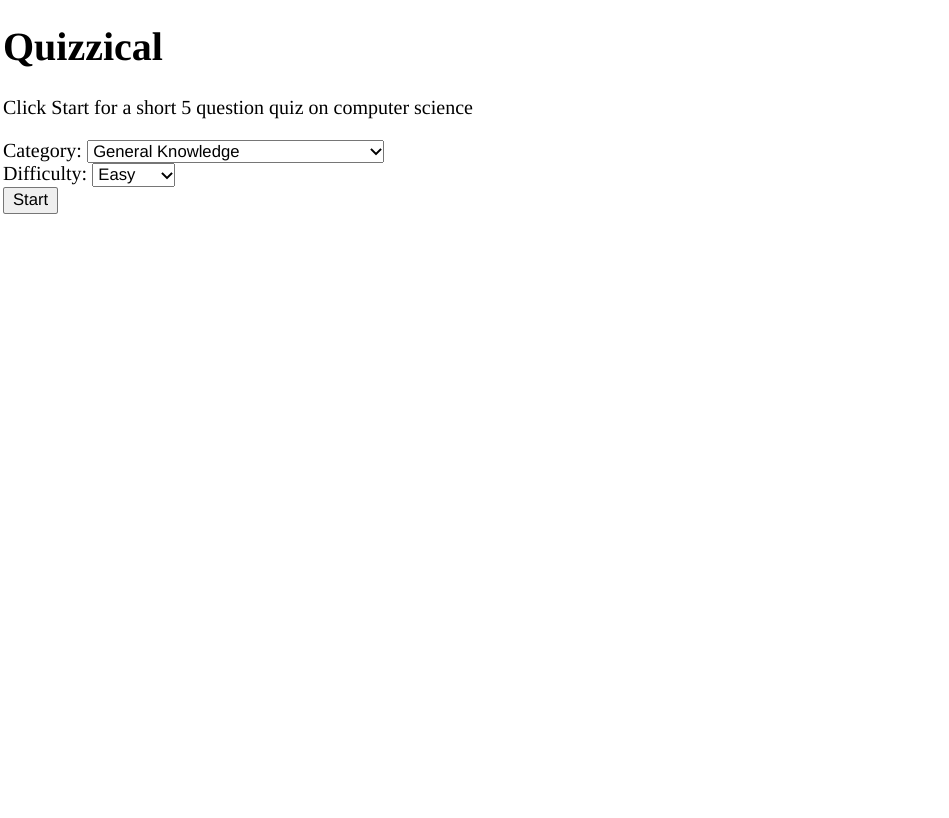
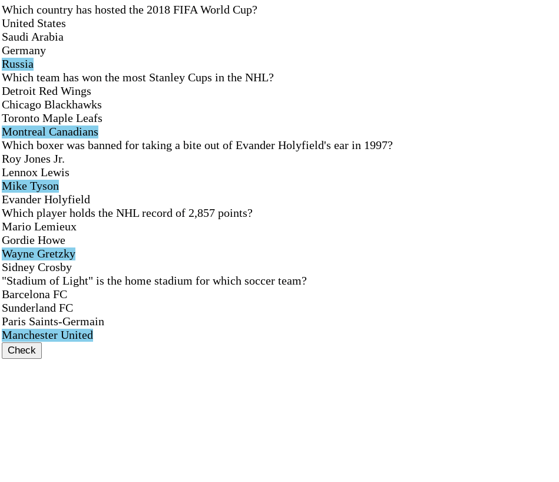
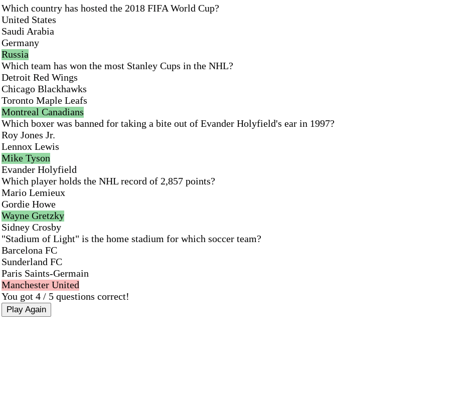

# Scrimba - Learn React for free Course
## Section 4 Solo Project: Quizzical

[Scrimba](https://scrimba.com/learn/learnreact/section-4-solo-project-co24f49bea8aace7c174082c8)

[Live Link](https://jdegand.github.io/scrimba-quizzical)

## Overview

## Thoughts 

- Originally tried to use radio buttons for answer choices
- Mapping an answers array to render a radio button - didn't really mix and I didn't find any examples where this was done so I abandoned that idea

- Shuffled answer choices with code found on Stack Overflow

- Answers and questions have html-code in them - looked at some other attempts on Github and found a decode function

- In question, used code equivalent to a nested ternary to conditionally render the styles

- Didn't conditionally render correct answer 
- Obviously, the idea was to add more conditional rendering practice but since questions repeat on some categories frequently, it may be a positive to not show the correct answer.

- Didn't style the app as the logic was not as solid as I would have liked
- handleChoice has way too much logic in it but the overly complicated data structure I started with and worrying about mutating state necessitated it
- Also performance wise - handleChoice is terrible

- Updating nested state is still a major disadvantage of React ie callback-esque hell
- Really hard to tell if you mutated state or not from just looking at the code

- After screenshots were taken,  added a break after question to break it up

- I duplicated components when making breaking changes - they are the all copy files

## Requirements 

- [x] Two Screens (start & questions)
- [x] Pull 5 questions from the OTDB API
- [x] Tally correct answers after "check answers" is clicked
- [ ] Styled & Polished

### Resources

- [Stack Overflow](https://stackoverflow.com/questions/2450954/how-to-randomize-shuffle-a-javascript-array) - Randomize array
- [Pluralsight](https://www.pluralsight.com/guides/how-to-use-radio-buttons-in-reactjs) - radio buttons & react
- [Stack Overflow](https://stackoverflow.com/questions/27784212/how-to-use-radio-buttons-in-reactjs) - radio buttons & react
- [Stack Overflow](https://stackoverflow.com/questions/48014390/how-to-handle-multiple-radio-button-groups-in-one-component-in-reactjs) - radio buttons
- [Stack Overflow](https://stackoverflow.com/questions/53051065/how-to-pass-multiple-values-of-selected-radio-button-in-react-js)
- [Blog](https://prateeksurana.me/blog/why-you-should-avoid-using-state-for-computed-properties/) - avoid state for computed properties
- [Geeks for Geeks](https://www.geeksforgeeks.org/how-to-handle-multiple-input-field-in-react-form-with-a-single-function/) - multiple inputs in react
- [YouTube](https://www.youtube.com/watch?v=zdhcxmugQYc) - ReactJS - Tutorial : How To Work With Multiple Radio Buttons with Function Based Components
- [PreTagTeam](https://pretagteam.com/question/setting-values-from-radio-buttons-generated-with-map-in-react-js) - radio buttons
- [Stack Overflow](https://stackoverflow.com/questions/34321128/render-array-of-inputs-in-react) - redner array of inputs
- [Stack Overflow](https://stackoverflow.com/questions/9907419/how-to-get-a-key-in-a-javascript-object-by-its-value) - get key in js object by value
- [YouTube](https://www.youtube.com/watch?v=zgKH12s_95A) - Dynamic Form Fields in React
- [FreeCodeCamp](https://www.freecodecamp.org/news/updating-state-from-child-component-onclick/) - update state onclick
- [TypeOfNan](https://typeofnan.dev/how-to-prevent-useeffect-from-running-on-mount-in-react/) - useeffect
- [Forum](https://forums.pixeltailgames.com/t/encoding-issues-in-questions-answers/34751/2) - encoding
- [YouTube](https://www.youtube.com/watch?v=ETNv7en7DBU) - React Quiz App tutorial
- [Stack Overflow](https://stackoverflow.com/questions/37828867/react-update-state-on-click) - updating state on click
- [Stack Overflow](https://stackoverflow.com/questions/37662708/react-updating-state-when-state-is-an-array-of-objects) - updating state when state is an array of objects
- [Stack Overflow](https://stackoverflow.com/questions/29537299/react-how-to-update-state-item1-in-state-using-setstate) - setState 
- [Stack Overflow](https://stackoverflow.com/questions/55987953/how-do-i-update-states-onchange-in-an-array-of-object-in-react-hooks) - updating state with hooks
- [Stack Overflow](https://stackoverflow.com/questions/43040721/how-to-update-nested-state-properties-in-react) - nested state & updating
- [Blog](https://nikitahl.com/how-to-assign-multiple-classes-in-react/) - multiple classNames workarounds
- [Stack Overflow](https://stackoverflow.com/questions/42630473/react-toggle-class-onclick) - toggle onclick
- [Stack Overflow](https://stackoverflow.com/questions/26069238/call-multiple-functions-onclick-reactjs) - multiple functions onclick in react ?
- [Dev.to](https://dev.to/samba_code/nested-ternary-statements-in-react-jsx-35kp) - nested ternary
- [Github](https://github.com/santivdt/quizzical/blob/2d90b75943bc180b620eec874ad1661803353a0b/utils/helpers.js#L1) - decode function taken from here
